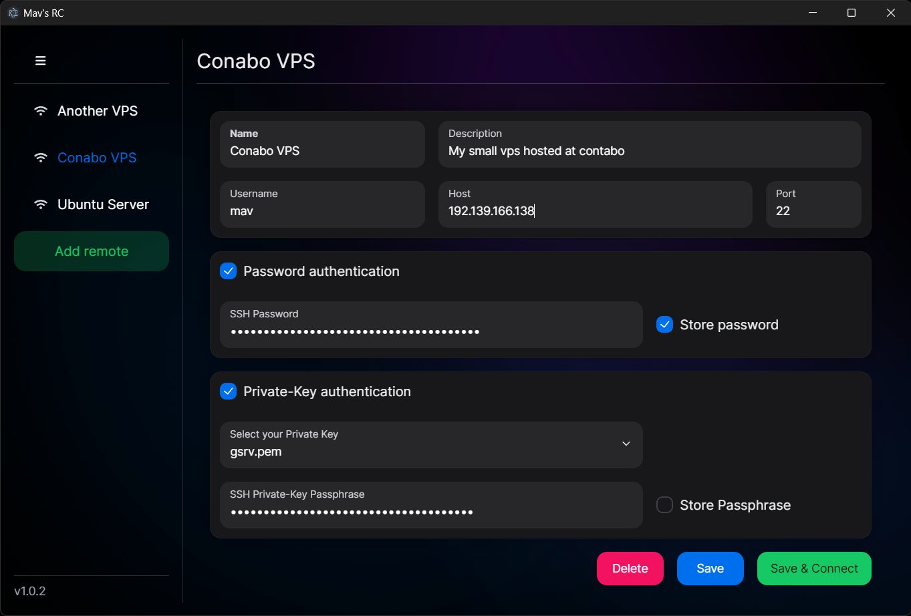
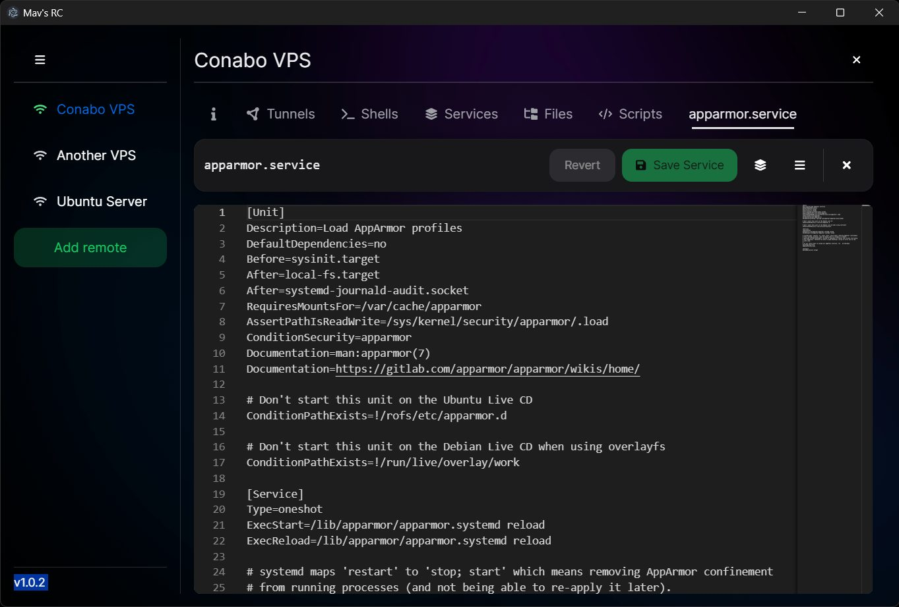

  

    
  

  
  
  

## 👋 Welcome

**Mav's RC** is an application designed to remotely control Linux systems through SSH/SFTP. It integrates multiple features into one seamless program, promoting ease of use without requiring any installations on the remote host.

Purpose and Open Source Spirit: Originally developed for personal use, I decided to open-source Mav's RC to contribute to the community—hoping it might assist others in managing their remote systems more efficiently. Feel free to contribute and please note, the application may contain bugs, and its use is at your own risk.

Compatibility Information: Built using Electron, Mav's RC is inherently multi-platform. However, it has been primarily tested on Windows 11. Testing on other platforms is planned, and your feedback is very welcome.

### Features

<table style="width:100%">
  <tbody>
    <tr style="vertical-align:top">
      <td width=100><b>Connect</b></td>
      <td align="left">
        <ul>
          <li><b>Connect to Linux:</b> Securely access Linux servers.</li>
          <li<b>Authentication Options:</b> Use password or public-key for authentication.</li>
         <li><b>Remote Management:</b> Manage multiple remote connections effectively.</li>
        </ul>
      </td>
      <td width=200 align="right">
         
      </td>
    </tr>
    <tr style="vertical-align:top">
      <td width=100><b>Shell</td>
      <td align="left">
        <ul>
          <li><b>Integrated Shell:</b> Execute commands and scripts directly within Mav's RC.</b></li>
        </ul>
      </td>
      <td width=200 align="right">
      
      </td>
    </tr>
    <tr style="vertical-align:top">
      <td width=100><b>Services</b></td>
      <td align="left">
        <ul>
          <li><b>Manage Services:</b> Start, stop, enable, or disable services.</li>
          <li><b>Logs and Monitoring:</b> View and monitor service logs.</li>
          <li><b>Service File Editor:</b> Modify service files directly.</li>
        </ul>
      </td>
      <td width=200 align="right">
      
      </td>
    </tr>
    <tr style="vertical-align:top">
      <td width=100><b>Explorer</b></td>
      <td align="left">
        <ul>
          <li><b>File and Folder Exploration:</b> Access and navigate files and folders on the remote system.</li>
          <li><b>Permissions Management:</b> Modify owner and permissions of the files and folders.</li>
          <li><b>File Operations:</b> Support for file and folder upload and download.</li>
        </ul>
      </td>
      <td width=200 align="right">
      
      </td>
    </tr>
    <tr style="vertical-align:top">
      <td width=100><b>Editor</b></td>
      <td align="left">
        <ul>
          <li><b>File Editing:</b> Edit files directly on the remote system.</li>
          <li><b>Advanced Options:</b> Extended features for service file editing.</li>
        </ul>
      </td>
      <td width=200 align="right">
      
      </td>
    </tr>
    <tr style="vertical-align:top">
      <td width=100><b>Tunnels</b></td>
      <td align="left">
        <ul>
          <li><b>Tunnel Management:</b> Set up and manage tunnels between localhost and remote systems.</li>
          <li><b>Socks5 Support:</b> Configure Socks5 proxies through tunnels.</li>
          <li><b>Auto-connect:</b> Option to automatically connect.</li>
        </ul>
      </td>
      <td width=200 align="right">
      
      </td>
    </tr>
  </tbody>
</table>

## 🔥 Get started
This section guides you through downloading and setting up Mav's RC. Choose from downloading pre-built releases or building the application from source.

### Download the Latest Release

You can download the latest version from our [GitHub Releases Page](https://github.com/dubdia/mavs-rc/releases). Please be aware that the executable is not code-signed, which may trigger a security warning on Windows.

### Building from source

If you prefer to build the application yourself or wish to contribute to its development, follow these steps:

#### Prerequisites

Ensure that Node.js is installed on your system.

#### Steps

1. Clone the repository or download the source:\
   `git clone https://github.com/dubdia/mavs-rc.git`\
   `cd mavs-rc`
2. Install dependencies:
   `npm install`
3. Build the application:
   `npm run make`

The built executable will be available in the /out directory.

### Debugging from source

To debug Mav's RC during development:

1. Follow the steps in Building from Source to set up the project.
2. Start the application with:
  `npm run start`
  or open the workspace in VS Code and navigate to “Run” -> “Start Debugging” or simply press F5 to start the debugging session.

## 🤓 Logging

Mav's RC does log to the terminal and file-system to assist in monitoring and debugging. Here’s how logging is handled and how you can customize it:

#### Log File Location
- Logs are created both in the terminal and in a dedicated file on the filesystem. On Windows systems, you can find the log file at:
_%APPDATA%\mavs-rc\rc.log_

#### Data Privacy
- SSH Credentials: To ensure security, SSH credentials are never logged.
- SSH Traffic: For detailed debugging, SSH traffic can optionally be logged when the log level is set to _debug_.

#### Customizing Log Levels
You’re able to adjust the verbosity of the logs through the application's configuration:
- Default Level: The preset log level is info.
- Configuration File: Modify the log level in the configuration file located at: _%APPDATA%\mavs-rc\config.json_
- The supported log levels are: _error_, _warn_, _info_, _debug_

## 🛡️ Security

The security of Mav's RC is a core priority, especially considering the application’s interaction with sensitive data, such as SSH credentials. While achieving absolute security in an Electron-based application with multiple dependencies can be challenging, significant measures have been implemented to mitigate potential risks:

#### Enabled Security Features:
Electron Security Policies: Extensive use of Electron's security capabilities:
- nodeIntegration set to false
- contextIsolation enabled
- webSecurity enforced
- allowRunningInsecureContent set to false
- Application sandboxing enabled

#### Content Security:
- Content-Security-Policy (CSP): Implemented strict CSP in index.html to mitigate cross-site scripting (XSS) risks: _script-src 'self'; worker-src 'self' blob:;_

#### Network Security:
- Network Requests: Electron configurations are in place to block unnecessary requests and redirects.
- Data Bundling: No external data requests post-launch; all necessary data is pre-bundled.
- Data Handling:
- SSH Credentials: SSH credentials and traffic details are excluded from application logs to preserve confidentiality.
- Fetch and XMLHttpRequest: Disabled native fetch and XMLHttpRequest functionalities in the renderer to reduce external attack vectors.

#### Maintenance and Auditing:
- Dependency Audits: Regular audits with npm audit confirm no known vulnerabilities in used packages.

#### Planned Enhancements:
- Encryption: Encrypting stored passwords within the configuration file

## 🐛 Troubleshooting
Encountering issues can be frustrating; here are some common problems and their potential fixes:

#### Service Manager Issues
Systemctl Dependencies

- The application relies on systemctl commands which require sudo privileges. If you are not logged in as root and encounter permission errors:
Consider modifying your sudoers file to provide necessary permissions to your user.

#### Application Failures
Crashes or Non-start Issues

- Check Logs: Review the log files for clues: _%APPDATA%/mavs-rc/rc.log_
- Reset Application Data: If issues persist, try deleting the application data directory. You may want to back up important configurations such as _sshServers.json_ beforehand: _%APPDATA%/mavs-rc/_

#### Build Issues
Failed Builds

- Update Node.js: Ensure your Node.js installation is up to date.
- Verbose Output: Use _npm run makeVerbose_ for more detailed build output.
- Clean Project: If builds still fail:
  - Delete node_modules, package-lock.json, .vite, and out directories.
  - Reinstall dependencies with _npm i_.
  - Restarting your development environment, such as Visual Studio Code, may resolve file lock issues.

#### Further Assistance
If these steps do not resolve your problems, do not hesitate to:
- Open an issue on GitHub for developer support.

## 📚 Project structure

The project was initialy created using electron forge with the [typescript vite template](https://www.electronforge.io/templates/vite-+-typescript).

- __src/__ contains the source code
  - __main/__ contains the main code of the electron app that has full access
  - __renderer/__ contains the js, css and html that runs in the browser/frontend. Has no permissions. Talks via IPC with the main part
  - __shared/__ contains code that is shared between main and renderer
- __out/__ contains the executables and setup files after calling _'npm run build'_

## ❤️ Credits

Mav's RC was built using a variety of cool open-source tools and libraries. Many thanks to the following projects and their contributors:

- [Electron](https://www.electronjs.org/): For enabling cross-platform desktop app capabilities.
- [Forge](https://www.electronforge.io/): Simplified the build process significantly.
- [React](https://react.dev/): For efficient UI development.
- [Vite](https://vitejs.dev/): Enhanced the development workflow with its super fast build tool.
- [SSH2](https://www.npmjs.com/package/ssh2) and [ssh2-promise](https://www.npmjs.com/package/ssh2-promise): For SSH communication capabilities.
- [NextUI](https://nextui.org/): Provided the elegant UI components.
- [XTerm](https://xtermjs.org/): Enabled the integrated terminal functionality.
- [Monaco Editor](https://www.npmjs.com/package/@monaco-editor/react): For the sophisticated text editing features.
- [TailwindCSS](https://tailwindcss.com/): For utility-first CSS management.

#### Custom Modifications

- __ssh2-promise__: I downloaded the package and made some minor modifications: mostly strictly typing and changed from CommonJs to ES6.
The modified code can be found under _/mavs-rc/src/main/ssh2-promise_

#### Visual Assets

- __Background Images/Gradient__: those are from [NextUI](https://nextui.org/)

## ⬇️ Screenshots

     

## 📰 Changelog

Changes are tracked in the [Changelog](CHANGELOG.md)

## 📰 License

[MIT](LICENSE)

