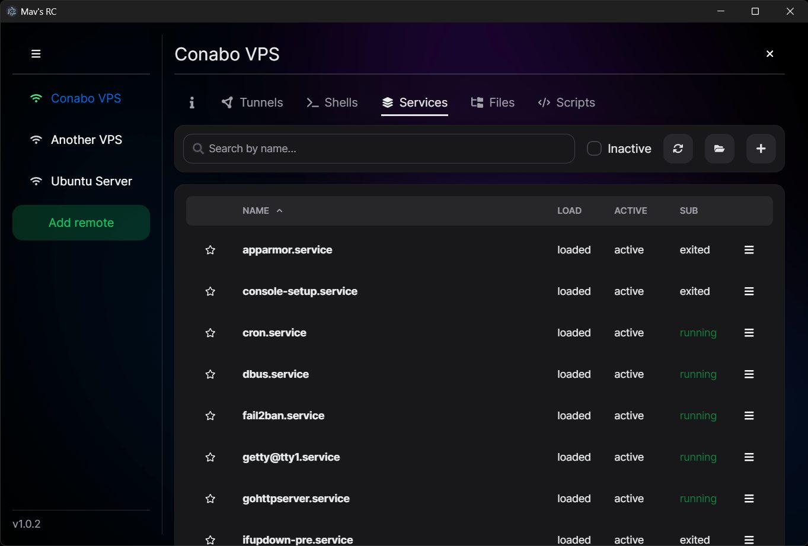
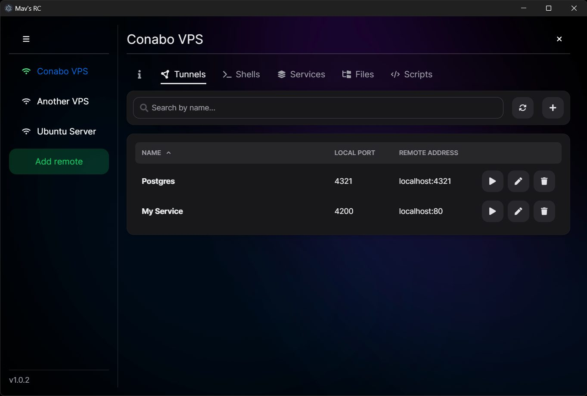

  

    
  

## 👋 Welcome

Mav's RC is a **application to remote control linux systems via ssh/sftp**. It aims to make interaction with a remote host easier by combing several features into one program and without the need of installing anything on the remote system.

I build this application for my personal use, but why not make it open-source so it may help others i thought so here we are. But please be aware that this application might contain bugs and use it at your own risk!

The application should be multi-platform because it was build using electron, but i have only tested it on Windows 11.

### Features

<table>
  <tbody>
    <tr style="vertical-align:top">
      <td><b>Connect</b></td>
      <td align="left">
        <ul>
          <li>Connect to Linux</li>
          <li>Authenticate via Password / Public-Key</li>
         <li>Manage multiple remotes</li>
        </ul>
      </td>
      <td align="right">
         
      </td>
    </tr>
    <tr style="vertical-align:top">
      <td><b>Shell</td>
      <td align="left">
        <ul>
          <li>Integrated Shell</b></li>
        </ul>
      </td>
      <td align="right">
      
      </td>
    </tr>
    <tr style="vertical-align:top">
      <td><b>Services</b></td>
      <td align="left">
        <ul>
          <li>Manage services (start, stop, enable, disable...)</li>
          <li>View logs</li>
          <li>Edit service files</li>
        </ul>
      </td>
      <td align="right">
      
      </td>
    </tr>
    <tr style="vertical-align:top">
      <td><b>Explorer</b></td>
      <td align="left">
        <ul>
          <li>View all files and folders on the remote system</li>
          <li>See and modify owner and permissions of files and folders</li>
          <li>File upload and download</li>
          <li>Folder download</li>
        </ul>
      </td>
      <td align="right">
      
      </td>
    </tr>
    <tr style="vertical-align:top">
      <td><b>Editor</b></td>
      <td align="left">
        <ul>
          <li>Edit files on the remote system</li>
          <li>Extended options when editing service files</li>
        </ul>
      </td>
      <td align="right">
      
      </td>
    </tr>
    <tr style="vertical-align:top">
      <td><b>Tunnels</b></td>
      <td align="left">
        <ul>
          <li>Manage tunnels between localhost and remote</li>
          <li>Socks5 support</li>
          <li>Auto connect option</li>
        </ul>
      </td>
      <td align="right">
      
      </td>
    </tr>
  </tbody>
</table>

## 🔥 Build, Run, Debug

#### Build from source

To run the application locally on your computer, follow these steps:

1. Download the repository containing mavs-rc
2. Ensure that [node](https://nodejs.org/en) is installed
3. Open a Terminal and navigate to /mavs-rc
4. Call _"npm i"_ to install the packages
5. Call _"npm run make"_ to build the application. The executables can then be found in the folder /mavs-rc/out

#### Debug from source

To debug the application, follow these steps:

1. Download the repository containing mavs-rc
2. Ensure that [node](https://nodejs.org/en) is installed
3. Open a Terminal and navigate to /mavs-rc
4. Call _"npm i"_ to install the packages
5. Call _"npm run start"_ to start the application. Or to debug the application in [VS-Code](https://code.visualstudio.com/) open the Workspace in VS-Code and click on "Run" -> "Start Debugging" (F5)

## 🤓 Logging

The application logs to the terminal and to the application data directory.
On windows, this directory is located here: _%APPDATA%\mavs-rc\rc.log_

Ssh credentials are never logged. Ssh traffic can be logged when log level is set to 'debug'.

#### Change log level

The default log level is "info". You can change the log level by adapting the config file which is located here: %APPDATA%\mavs-rc\config.json

Supported log levels: _'error', 'warn', 'info', 'verbose', 'debug', 'silly'_

## 🛡️ Security

First of all, this is a electron react application, that in total has about 620 packages from other people and companies.
So, a 100% security may not be possible.

But as this application handles very sensitive data like ssh credentials, i take security **very serious** and took some measurments harden the app:

- All security features of electron are activated: _nodeIntegration: false, contextIsolation: true, webSecurity: true, allowRunningInsecureContent: false, sandbox: true_
- The native fetch and XMLHttpRequest functionality is disabled in the renderer
- The index.html has a strict Content-Security-Policy: _(script-src 'self'; worker-src 'self' blob:;)_
- Electron is configured to block any requests and redirects that are not required
- Ssh credentials and traffic is not included in the applications log files by default
- The application does not load any data from the internet after starting and all required data is bundled into the application
- Lastly i checked for npm vulnerabilities via _'npm audit'_ and by the time of writing 0 are found.

Todos:

- Verifiy traffic using Wireguard
- Encrypt passwords that are stored in config

## 🐛 Troubleshooting

If the application does not start or crash:

- Maybe the logs can give you a clue: _%APPDATA%/mavs-rc/rc.log_
- Delete the application data directory which is located here _%APPDATA%/mavs-rc/_ (maybe backup your sshServers.json config before doing so)

When you have problems with building the application from source:

- Ensure you have a new version of Node installed
- Call _"npm run makeVerbose"_ instead of "npm run make" to get more information
- Delete _/node_modules_, _/package-lock.json_, _/.vite_, and _/out_ and then call _"npm i"_

If that does not help feel free to leave a ticket here on GitHub :)

## 📚 Project structure

The project was initialy created using electron forge with the [typescript vite template](https://www.electronforge.io/templates/vite-+-typescript).

- __src/__ contains the source code
  - __main/__ contains the main code of the electron app that has full access
  - __renderer/__ contains the js, css and html that runs in the browser/frontend. Has no permissions. Talks via IPC with the main part
  - __shared/__ contains code that is shared between main and renderer
- __out/__ contains the executables and setup files after calling _'npm run build'_

## ❤️ Credits

I used those technologies and packages without this project would not be possible like this so many thanks to:
[Electron](https://www.electronjs.org/), [Forge](https://www.electronforge.io/), [React](https://react.dev/), [Vite](https://vitejs.dev/), [SSH2](https://www.npmjs.com/package/ssh2), [ssh2-promise](https://www.npmjs.com/package/ssh2-promise), [NextUI](https://nextui.org/), [XTerm](https://xtermjs.org/), [Monaco Editor](https://www.npmjs.com/package/@monaco-editor/react), [TailwindCSS](https://tailwindcss.com/)

#### About the ssh2-promise package

I downloaded the package and made some minor modifications: mostly strictly typing and changed from CommonJs to ES6.
The modified code can be found under _/mavs-rc/src/main/ssh2-promise_

#### About the background images / gradient

They are from next-ui

## ⬇️ Screenshots

     

## 📰 License

[MIT](LICENSE)
